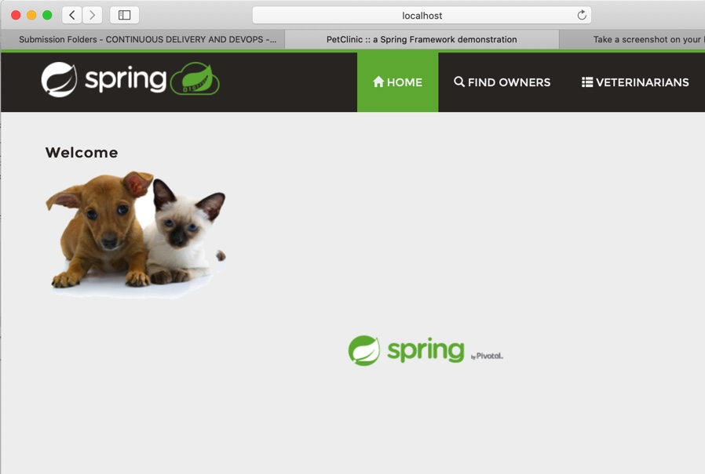

Assignment 8 Submission

DOCKER 

Note: I usually use Windows to do homework. Since Docker requires Win Pro or Enterprise, I had to setup Docker Toolbox to run and everything was fine except that I could not reach localhost: 8484. So I tried to do it on Mac and I can finally access the localhost:8484. 

5 pts Your dockerfile. Please provide a link to this file rather than a screen capture.

https://github.com/NLE11/spring-petclinic/blob/master/Dockerfile

5 pts Your running docker instance as shown by a ps command.

5 pts Your browser accessing the main page of the website from your local container.

